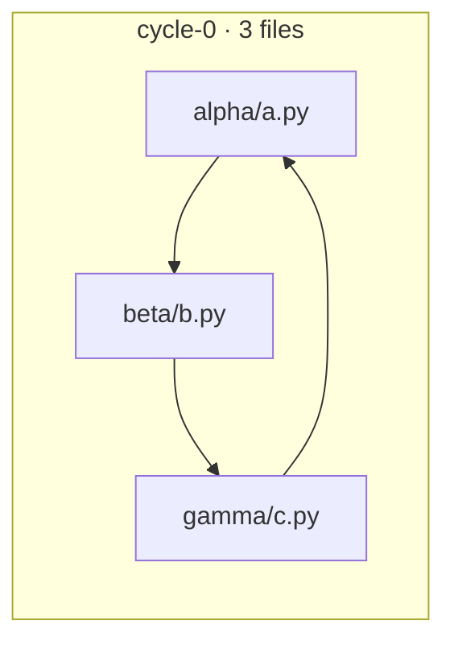

# Navune

**Structural code-quality analysis for your codebase — in one CLI.**

Navune (NAV + UNE, from Latin *nāvis*, "ship/navigate") is a command-line
analyzer that computes *structural quality* metrics for Go,
TypeScript/JavaScript, Python, C, C++, Java, and Rust codebases: size,
cyclomatic and cognitive complexity, comment density, function shape,
duplication, internal dependency graphs, cyclic dependencies, and Martin's
coupling metrics. It judges the result against configurable budgets, reports
deterministic structural smells, and emits a transparent 0–100 composite score.

- [Quickstart](#quickstart)
- [Why structural quality?](#why-structural-quality)
- [Features](#features)
- [Language support](#language-support)
- [Output formats](#output-formats)
- [Shell completion and man page](#shell-completion-and-man-page)
- [Configuration](#configuration-navuneyaml)
- [The composite index](#the-composite-index-transparent-by-design)
- [What counts as "the codebase"](#what-counts-as-the-codebase)
- [Documentation](#documentation)
- [Architecture](#architecture)
- [Development](#development)
- [Roadmap](#roadmap)
- [Design record](#design-record)

## Quickstart

Requires Go 1.27+, cgo, and a C toolchain (tree-sitter grammar bindings).

```sh
# From source (or: go install github.com/lcr/navune/cmd/navune@latest)
git clone git@codeberg.org:LCRERGO/Navune.git && cd Navune
make build            # produces ./bin/navune

# Analyze a codebase.
./bin/navune analyze .                      # default text report
./bin/navune analyze ./src --format json    # machine-readable
./bin/navune analyze . --format mermaid --out deps.mmd

# Create a project config, then gate your CI on the exit code.
./bin/navune init
```

A real run against a small Python fixture (a 3-file dependency cycle):

```
$ navune analyze test/fixture-py   [module fixture-py]

Files:  3 production · 1 test · 1 generated skipped · 1 dirs excluded
Size:   33 physical SLOC · 25 logical LOC
Types:  2 (0 abstract)
Complexity:  avg 2.20 / function · worst 3 (pkg/alpha/a.py: helper)
Cognitive:   avg 1.30 / function · worst 3
Shape:       longest 6 lines · max nesting 2 · max params 1
Comments:    0 lines (0.00%)
Duplication: 0 / 212 tokens (0.00%) · 0 blocks · 0 lines
Cycles:      1 component(s) · 3/3 files in cycle (100.00%) · largest 3

Cyclic dependencies (structural debt):
  cycle-0 (3 files): pkg/alpha/a.py -> pkg/beta/b.py -> pkg/gamma/c.py

Production files:
  file                    SLOC  worst    dup%  cycle
  pkg/alpha/a.py           14      3   0.00%      y
  pkg/beta/b.py             7      3   0.00%      y
  pkg/gamma/c.py           12      2   0.00%      y

Quality gate (budgets):
  [Error] avg_complexity      2.20 / 10.00       ok
  [Warn] max_in_cycle_pct   100.00 / 10.00  BREACHED
  ...
Composite index: 66.1 / 100
Exit code: 0 (PASS)
```

The full CLI reference — commands, flags, examples, exit codes — is in
[`docs/usage.md`](docs/usage.md).

## Why structural quality?

Navune is deliberately **structural**, not a linter and not a security scanner.
It measures how a codebase is *structured* — dependency cycles, coupling,
complexity, duplication — the properties that determine whether a codebase
stays maintainable as it grows. Bug hunting and vulnerability scanning are the
domain of language-native tools (`go vet`, `staticcheck`, `govulncheck`) and
Navune does not try to replace them.

## Features

- **Unit of analysis is the file, in every language** — one uniform element
  model (`file → type/class → function/method`), one metric pipeline.
- **Full metric set**: physical & logical SLOC, cyclomatic and cognitive
  complexity, comment density, function length/nesting/parameters, duplication,
  dependency cycles (SCCs), Ca/Ce → instability, abstractness, and distance from
  the main sequence. See [`docs/metrics.md`](docs/metrics.md).
- **Deterministic structural smells.** Ten threshold rules over those measures
  produce located issues with MQR severities — no hand-written bug database, no
  heuristics. See [ADR 0016](docs/adr/0016-deterministic-smell-layer.md).
- **Budgets first, composite second.** `navune.yaml` defines per-metric limits;
  breach an `error`-tier budget and the exit code says so (0 pass · 1 breach ·
  2 usage error). The 0–100 composite is a *transparent, documented blend* of
  per-metric distance-from-budget — no opaque industry numerology. Budgets can
  be global or per-language.
- **Multi-language.** Go (via `go/parser`), TypeScript/JavaScript and Python
  (via the official tree-sitter Go bindings), and C/C++ (shared tree-sitter
  adapter) feed the same uniform element model. Building requires cgo and a C
  toolchain.
- **Machine contracts.** A versioned JSON schema is the primary integration
  surface; a Mermaid exporter renders the dependency graph (cycles visible in
  your editor) for free.
- **Deterministic.** Report output is stable and ordered — suitable as a
  regression signal in CI.

## Language support

| Language              | Backend                   | Status |
|-----------------------|---------------------------|--------|
| Go                    | `go/parser` (pure Go)     | v1     |
| TypeScript/JavaScript | tree-sitter (cgo)         | v1.1   |
| Python                | tree-sitter (cgo)         | v1.1   |
| C                     | tree-sitter (cgo)         | v1.2   |
| C++                   | tree-sitter (cgo)         | v1.2   |
| Java                  | tree-sitter (cgo)         | v1.3   |
| Rust                  | tree-sitter (cgo)         | v1.3   |

> Why tree-sitter (and cgo)? No importable pure-Go TypeScript parser exists
> (esbuild's parser is `internal/` to its module), and tree-sitter's Go
> bindings — runtime and grammars — require cgo. See
> [ADR 0007](docs/adr/0007-parsing-backend-cgo.md). For TS/JS and Python,
> import/dependency resolution is workspace-root best-effort: relative
> specifiers and dotted modules that map to an analyzed file are internal;
> everything else (node_modules, site-packages, bare packages) is external.
> C/C++ use one shared `internal/lang/cfamily` adapter over the
> `tree-sitter-c`/`tree-sitter-cpp` grammars, with `#include` resolved quoted-
> relative and against `include_paths`; `.h` files are content-sniffed
> ([ADR 0017](docs/adr/0017-c-and-cpp-adapters.md)). Java and Rust have their
> own adapters ([ADR 0019](docs/adr/0019-java-and-rust-adapters.md)): Java
> imports resolve against a package index built from declared `package`
> clauses, and Rust `mod`/`use` paths resolve against the file tree
> (`crate::` under `src/`). Inline Rust `#[cfg(test)]` code is counted as
> production — the file-level unit cannot separate it.

## Output formats

`navune analyze --format <text|json|yaml|mermaid>`:

- **text** (default) — the human-readable summary shown in the quickstart.
- **json** — a stable, versioned schema (`schema_version: 1`), the machine
  contract for CI and other tools.
- **yaml** — the same `schema_version: 1` schema serialized as YAML, for
  config-adjacent consumers; a second machine contract (ADR 0008 revision 1).
- **mermaid** — a `flowchart` of the internal dependency graph. Files that
  participate in a cycle are grouped into per-cycle subgraphs, so structural
  debt is visible in your editor:



## Shell completion and man page

Navune ships a bash completion (`completions/navune.bash`) and a man page
(`man/navune.1`). They are committed static files — no new subcommands and no
generation step ([ADR 0018](docs/adr/0018-packaged-completion-and-manpage.md)).

```sh
# Install under PREFIX (default /usr/local); honors DESTDIR for staging.
make install-completions   # .../share/bash-completion/completions/navune
make install-man           # .../share/man/man1/navune.1

# Or source the completion directly from a checkout.
source completions/navune.bash

# Read the man page without installing it.
man ./man/navune.1
```

Release archives include both files under `completions/` and `man/`.

## Configuration (`navune.yaml`)

```yaml
version: 1

exclude:            # extra globs on top of built-in patterns
  - "legacy"
  - "**/migrations/**"

budgets:            # per-metric limits; tier sets severity (error|warn)
  avg_complexity:        { limit: 10,  tier: error }
  worst_complexity:      { limit: 50,  tier: error }
  max_duplication_pct:   { limit: 5,   tier: warn }
  max_cycle_members:     { limit: 8,   tier: error }
  max_in_cycle_pct:      { limit: 10,  tier: warn }

weights:            # composite blend; every budgeted metric may be weighted
  avg_complexity:        25
  worst_complexity:      15
  max_duplication_pct:   20
  max_cycle_members:     20
  max_in_cycle_pct:      20

smells:             # structural smell rules; all enabled by default
  cognitive-complexity: { enabled: true, threshold: 15, severity: high }

language_smells:    # per-language threshold overrides (full rule objects)
  python:
    function-length: { threshold: 50 }

language_budgets:   # per-language limits, evaluated in addition to the global ones
  python:
    avg_complexity: { limit: 8, tier: warn }

include_paths:      # C/C++ #include search directories (relative to this file)
  - include
  - third_party/headers
```

Run `navune init` to write this commented template to your project root.
`navune analyze` auto-discovers `navune.yaml` by walking upward from the
analyzed path; `--config` overrides discovery. The full schema — smell rules,
per-language overrides, and `include_paths` — is specified in
[ADR 0016](docs/adr/0016-deterministic-smell-layer.md) and
[ADR 0017](docs/adr/0017-c-and-cpp-adapters.md).

## The composite index (transparent by design)

The 0–100 composite is *not* an invented industry score. For each weighted
metric, Navune computes how far the measured value is from its configured
budget:

```
metric_score = clamp(100 * (1 - (value / budget)), 0, 100)   # smaller is better
composite    = Σ (weight_m × metric_score_m) / Σ weight_m     # 0..100
```

Every number in the report is traceable to a formula and a config line. The
budget is the anchor; breach one and the exit code flips regardless of the
composite — budgets decide, the composite informs.

## What counts as "the codebase"

- **Generated & vendored code is skipped** (`vendor/`, `node_modules/`,
  `*.pb.go`, `*.min.js`, lockfiles, …) with sensible built-in patterns,
  overridable in config.
- **Test files are analyzed but kept in a separate `tests` namespace** — visible
  in reports, excluded from budgets, cycles, coupling, the composite, and the
  smell layer. A file is a test if its name matches the language's pattern or it
  sits under a `test`/`tests` path component below the analysis root.
- **Only internal edges count** toward metrics and gates. Imports that do not
  resolve to an analyzed file (stdlib, `node_modules`, site-packages, system
  headers) never become graph edges.

## Documentation

| Doc | What it covers |
|---|---|
| [`docs/usage.md`](docs/usage.md) | Full CLI reference: commands, flags, exit codes, examples. |
| [`docs/metrics.md`](docs/metrics.md) | Per-metric definitions, formulas, budget keys and defaults. |
| [`docs/glossary.md`](docs/glossary.md) | Shared vocabulary; metric definitions are authoritative here. |
| [`docs/development.md`](docs/development.md) | Contributor guide: pipeline, invariants, extending languages. |
| [`docs/adr/`](docs/adr/) | The design record behind every decision. |

`navune help` and `navune help <command>` reproduce the essentials at the
terminal.

## Architecture

The repository follows the [golang-standards project layout](https://github.com/golang-standards/project-layout).

```
cmd/navune             CLI entry point (analyze / init / version / help)
internal/              private application & analysis code (not importable by others)
  analysis             pipeline orchestration; summary aggregation; import
                       resolution for scripts; stable Report model
  config               navune.yaml parsing, defaults, budgets, weights, exclusions
  discover             file walking, exclusions, nested-module detection, go.mod lookup
  dup                  token-normalized duplication detection (cross-file + intra-file)
  gate                 budget evaluation, verdict, exit codes, transparent composite
  graph                internal dependency graph, SCC cycle detection (Tarjan),
                       coupling Ca/Ce, instability/abstractness, main-sequence distance
  smell                deterministic structural rules → located issues (MQR severities)
  lang                 uniform element model (file → type → function); parser interface
  lang/golang          Go adapter over go/parser → element model + normalized tokens
  lang/treescript      TS/JS adapter over the tree-sitter JS/TS grammars
  lang/python          Python adapter over the tree-sitter Python grammar
  lang/cfamily         C/C++ adapter over the tree-sitter C/C++ grammars (shared)
  lang/java            Java adapter over the tree-sitter Java grammar
  lang/rust            Rust adapter over the tree-sitter Rust grammar
  report               text summary, versioned JSON schema, Mermaid graph export
configs/               sample navune.yaml configuration
docs/                  usage, metrics, glossary, ADRs and contributor guide
test/                  external test data: committed golden fixtures
                       (fixture/ Go, fixture-ts/, fixture-py/, fixture-c/,
                       fixture-java/, fixture-rust/), nested modules
```

Language adapters convert a parsed AST into Navune's uniform element model and
a normalized token stream, so the entire metric/graph/report pipeline is
written once and reused by every language. TS/JS and Python use the official
tree-sitter Go bindings (cgo); import resolution for them is workspace-root
best-effort (`internal/analysis/resolve.go`).

### Repository layout notes

- `internal/` holds all Go packages; they are private by compiler enforcement.
- `test/` contains `fixture/` (Go), `fixture-ts/`, `fixture-py/`, and
  `fixture-c/`, each a
  self-contained module used as golden test data. Being nested modules
  (`go.mod` inside), they are excluded from `go build ./...`, `go test
  ./...`, and Navune's own analysis runs, exactly like the Go toolchain skips
  nested modules.
- `configs/navune.yaml.example` documents a full configuration file.
- Building requires cgo and a C toolchain (tree-sitter); see
  [ADR 0007](docs/adr/0007-parsing-backend-cgo.md).

## Development

```sh
make build    # or: go build ./...
make test     # or: go test ./...
make vet      # or: go vet ./...
make evolve   # opt-in fixture-evolution suite (-tags evolution)
make analyze  # run Navune on its own source tree
```

See [`docs/development.md`](docs/development.md) and
[`AGENTS.md`](AGENTS.md) for contributor guidance.

## Roadmap

- **v1** — Go, full metric model including duplication.
- **v1.1** — TypeScript/JavaScript + Python via tree-sitter.
- **v1.2** — extended structural measures (cognitive complexity, comments,
  function shape, duplicated lines), the deterministic smell layer, and C/C++
  ([ADR 0015](docs/adr/0015-extended-structural-measures.md),
  [ADR 0016](docs/adr/0016-deterministic-smell-layer.md),
  [ADR 0017](docs/adr/0017-c-and-cpp-adapters.md)).
- **v1.3** — YAML output format and Java + Rust adapters
  ([ADR 0019](docs/adr/0019-java-and-rust-adapters.md)).
- **later** — HTML report; directory-level aggregation views.

## Design record

Every design decision is recorded as an ADR in [`docs/adr/`](docs/adr/) —
tool shape, metric model, file-level units, parser backend, quality-gate
semantics, output contracts, and the verification bar. A shared vocabulary
lives in [`docs/glossary.md`](docs/glossary.md). Metric definitions there are
authoritative.

## License

MIT.
